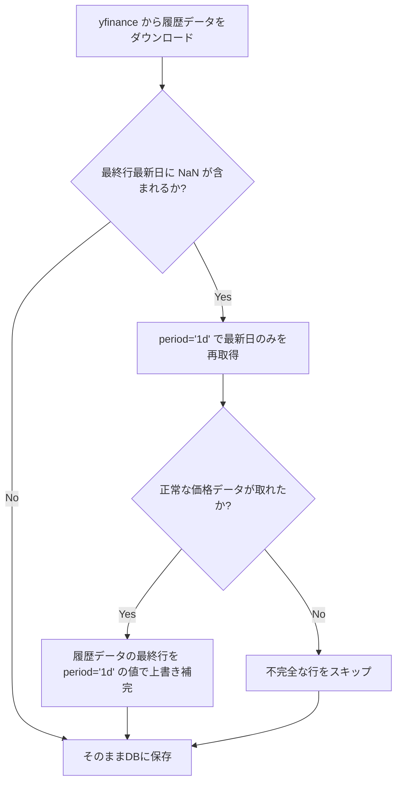

# yfinance最新データ欠損（NaN）対策の仕様ドキュメント

このドキュメントでは、株価データ取得時に Yahoo Finance (yfinance) 由来で発生する最新営業日データの欠損（NaN）問題と、その対策として導入した自動補完ロジックについて解説します。

---

## 1. 発生していた問題（背景）

### 現象
- 特定の銘柄（例: セイコーエプソン `6724` など）において、最新営業日のデータで出来高（`Volume`）のみが取得でき、価格情報（`Open`, `High`, `Low`, `Close`）がすべて `NaN`（欠損）として取得される現象が発生していました。
- この状態のままデータベースに保存されると、フロントエンドの株価チャートが崩れたり、最新データに基づいて未来の価格変動を予測する AI 予測 API (`/api/predict/{code}`) が内部で `NaN` 計算エラーを引き起こし、HTTP 500 で動作を停止していました。

### 原因
- **Yahoo Finance のデータ更新ディレイ**: 
  日本の株式市場の取引終了後（15:00以降）から数時間、あるいは翌日にかけて、yfinance が提供するヒストリカルデータのエンドポイント（`start` 日付の指定や、`period` が 2日以上の場合）で、最新日の終値 `Close` などの価格が `NaN` になる不整合期間があります。
- **不完全データの固定化**:
  一度データベースに（価格が欠損した）レコードが登録されると、自動更新処理は該当日のデータを「処理済み」としてスキップするため、後から Yahoo Finance 側でデータが確定しても自動で修復されない状態になっていました。

---

## 2. 解決策と設計

### 技術的発見
- `yf.Ticker(code).history(start=...)` や `period="1mo"` などで取得すると、最新日の価格は `NaN` になります。
- しかし、当日のみを指定する `yf.Ticker(code).history(period="1d")` オプションで取得した場合は、Yahoo Finance のリアルタイムクォート用のエンドポイントが叩かれるため、**最新営業日の価格情報（`NaN`なし）が即座に取得できる**という特性が判明しました。

### 補完アーキテクチャ
この特性を利用し、以下の自動自己補完ロジックを実装しました。



---

## 3. 実装の適用箇所

### ① APIサーバー側 ([main.py](file:///c:/Users/nabe4/kabukakasika/backend/main.py))
- **`/api/stock/{code}`**
  - **新規銘柄取得時**: `period="3y"` で取得したデータの最終行に `NaN` がある場合、`period="1d"` で補完します。
  - **差分自動更新時**: `start_date` からのデータ取得時、最終行の価格が `NaN` であれば同様に `period="1d"` で補完します。
  - **壊れたデータの自動修復**: 差分更新処理の開始時に、DB内に既に存在する価格欠損レコード（`open IS NULL OR close IS NULL`）を自動的に削除し、上記の補完プロセスを介して再取得を促すガードを追加しました。

### ② 定期バッチ側 ([update_db.py](file:///c:/Users/nabe4/kabukakasika/backend/update_db.py))
- **`update_stock_data()`**
  - バッチ実行時に取得した差分ヒストリカルデータにおいて、最終行（最新日）が `NaN` であれば同様に `period="1d"` で補完した上で一括登録します。これにより、バッチ処理でデータが不完全なまま蓄積されることを防止します。

---

## 4. トラブルシューティングと手動修復

もし今後、特定の銘柄で最新データの不整合が疑われる場合、以下の手順で手動修復が可能です。

### 手動データ修復手順
1. SQLite データベース (`backend/stock_data.db`) から、対象銘柄の不完全レコードを削除します。
   ```sql
   DELETE FROM stock_prices WHERE code = '6724' AND (open IS NULL OR close IS NULL);
   ```
2. API サーバーが起動している状態で、ブラウザや `curl` から対象銘柄の API にアクセスします。
   ```powershell
   Invoke-RestMethod -Uri "http://localhost:8000/api/stock/6724"
   ```
3. これにより、自動的に DB 内の欠損レコード削除がトリガーされ、上記補完ロジック経由で `period="1d"` から最新株価が再取得され、DBが正常な状態で更新されます。
